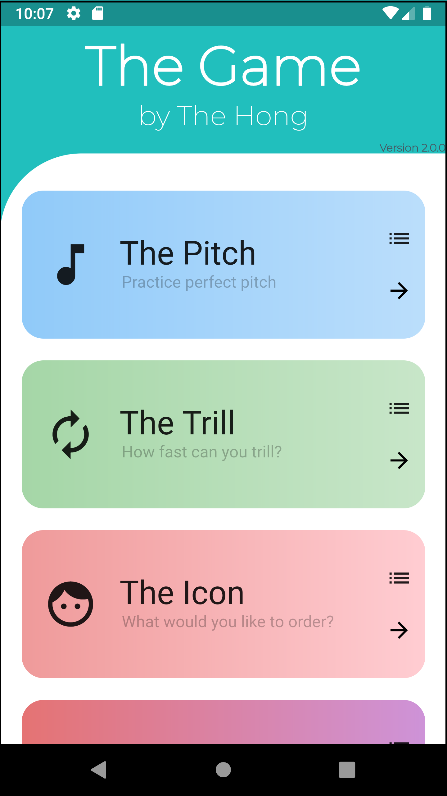

# TheGame
Mobile Application with various games. Currently working on Version 2.0.0. The mobile application is developed using Dart language with the Flutter toolkit and makes use of Google Firebase's Cloud Firestore database to store historical results as well as to allow for remote disabling of certain games in the cases of urgent bug fixes. 

Below is an overview of the available games. 

| Game | Description|
| :-------: | ---------|
| The Pitch | Player attempts to determine the note corresponding to tones as quickly as possible. |
| The Trill | Player attempts to trill (using two fingers of same hands to alternating tapping) as quickly as possible. |
| The Icon  | Player attempts to remember and recall the order of icons shown. (*coming soon*) |
| The Icons  | Player attempts to remember and recall the order and visuals of icons shown. (*coming soon*) |
| The Sign  | Player attempts to be able to perform English<->ASL translation. (*coming soon*) |

## Releases (and their major updates)

In the following releases, the game is played (and tested) on phones of two people.

### Version 1.3.0
- Make The Trill keys more sensitive to presses
- Additional score also displayed in results screen (if applicable)
- Developer's suite now allows for custom-named backups
- Game stats can only be updated when results activated

### Version 1.2.1
- Fix the processing stage of Firestore game commands so that home page loads properly 
- Stats updated only once per game even though submit button is pressed multiple times
- Developer's suite allows for games with the suite to backup data remotely

### Version 1.2.0
- Additional score field allows for The Pitch to also display and record the number of rounds that were correct.
- Add warning sign on home page if result update is disabled but game is still playeable
- Game stats update even when user clicks the appbar back button.
- Prevent multiple clicks in various buttons, including:
    - Name submit button, which caused game scores to be added to leaderboard multiple times.
    - Begin button in The Pitch, which caused multiple games of The Pitch to be initiated.
    - Minikey pressors in The Trill, which caused multiple games of The Trill to be initiated if pressed quickly enough.

### Version 1.1.0
- Games can be disabled remotely by changing parameters in Firestore
- Make the dealing of abrupt game ends more robust
- Include version

### Version 1.0.0
- Released The Pitch and The Trill

